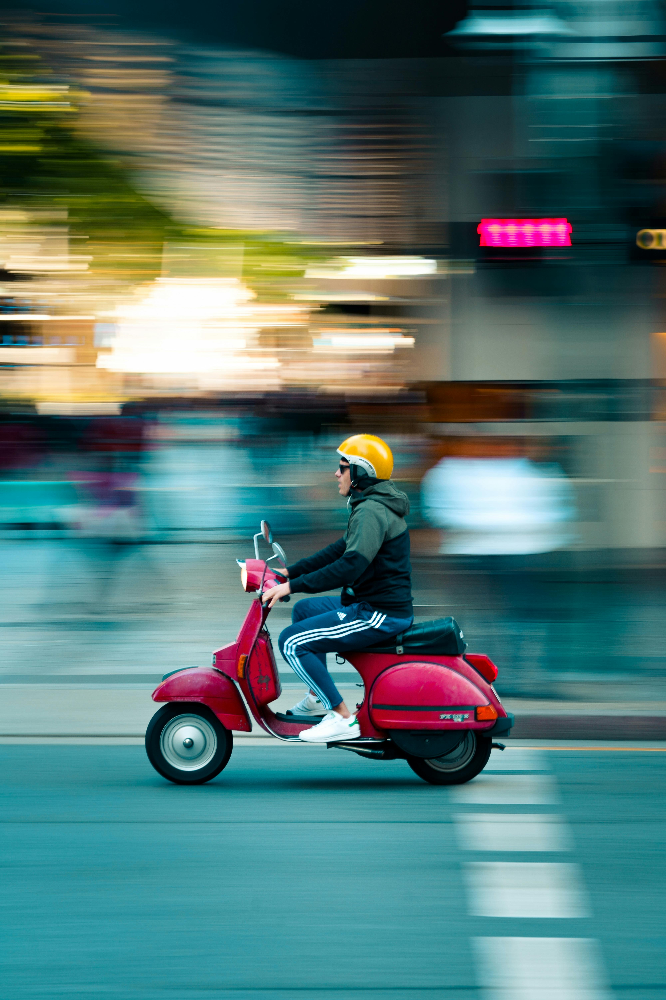
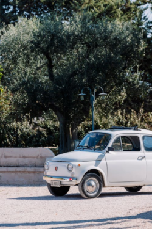

# Project Photography Techniques

## Panning

Panning is a camera technique where you move the camera to follow a moving subject at a slow shutter speed, resulting in a sharp subject against a dynamically blurred background that creates a sense of motion and speed.

## Camera Parameters for Panning
- Slower shutter speed
- Follow object with camera
- Decrease aperture (large f/x)
- Neutral density filter

## Creating Panning Effect from Static Image

How we can create the same effect from a photo of a motionless object?

## Requirements
- streamlit
- opencv-python
- numpy
- pandas
- rembg

## How to Run

1. Install required packages
   
   `pip install streamlit opencv-python numpy pandas rembg`

2. Run the Streamlit app:

   `streamlit run cis5810_baseline.py`

## Image Credits

Panning effect image: Pexels - Photo of Man Riding Red Motor Scooter

Static car image: Pexels - Classic Fiat 500 Parked on a Gravel Road

